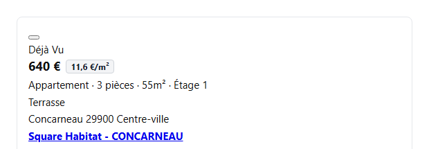
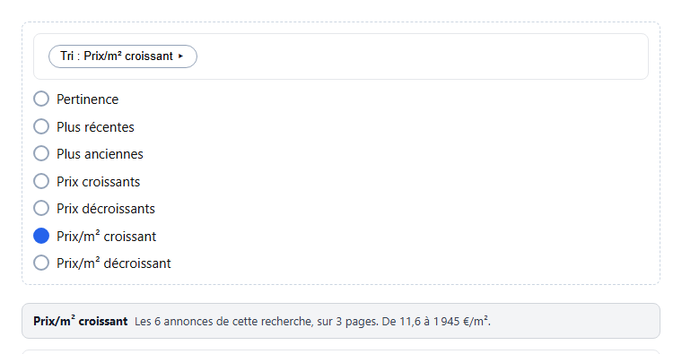

<div align="center">
  
  <h1>Prix au m² pour leboncoin</h1>
  <p><strong>Price per square metre, where leboncoin does not show it.</strong></p>
  <p>
    A Chrome and Firefox extension that works out the price per square metre of
    every property ad and shows it next to the price. It also adds two sort
    options leboncoin does not offer: by price per square metre, ascending and
    descending.
  </p>
</div>

<p align="center">
  <a href="https://github.com/mpek29/lbc-prix-m2/releases/latest"></a>
  <a href="https://github.com/mpek29/lbc-prix-m2/actions/workflows/ci.yml"></a>
  <a href="LICENSE"></a>
  
  
</p>

<p align="center">
  <a href="https://github.com/mpek29/lbc-prix-m2/releases/latest"><strong>Download</strong></a>
  ·
  <a href="#install">Install</a>
  ·
  <a href="docs/architecture.md">Architecture</a>
  ·
  <a href="docs/adr/">Decisions</a>
  ·
  <a href="CONTRIBUTING.md">Contributing</a>
  ·
  <a href="https://github.com/mpek29/lbc-prix-m2/issues">Issues</a>
</p>

<p align="center">
  
</p>

## What it adds

| leboncoin gives you                  | The extension adds                               |
| ------------------------------------ | ------------------------------------------------ |
| The price of an ad                   | The price per m², right next to it               |
| Sorting by relevance, date, price    | Sorting by price per m², ascending or descending |
| One page of results at a time        | Every page, collected and then sorted            |
| No indication of how sound a sort is | What was sorted, and what is missing             |

## Preview

<p align="center">
  
</p>

The two options join leboncoin's sort menu. They are built by cloning their own
components, so they follow whatever design leboncoin is using.

## Install

No signed build is published yet, so there are two routes.

**Temporary, to try it out**

| Browser | Steps                                                                          |
| ------- | ------------------------------------------------------------------------------ |
| Firefox | `about:debugging#/runtime/this-firefox` → _Load Temporary Add-on_ → the `.zip` |
| Chrome  | `chrome://extensions` → Developer mode → _Load unpacked_                       |

Firefox forgets temporary add-ons when it closes.

**Permanent**

Firefox refuses unsigned extensions on the release channel, and the
`xpinstall.signatures.required` preference does nothing there. Mozilla signs
self-distributed add-ons for free, with no public listing, usually in under a
minute: `npm run sign:firefox`. Full steps in
[CONTRIBUTING.md](CONTRIBUTING.md#a-permanent-firefox-install).

Every release page repeats the install steps, so there is no need to come back
here for them.

## How it works

leboncoin renders its results client side and ships class names with a build
hash in them. Both halves of the obvious approach are therefore traps: there is
nothing in the DOM when the content script first runs, and the class you keyed
off yesterday is gone today.

So the extension does two other things. It watches for mutations and re-runs a
stateless pass whenever the page changes. And it reads the page through its
accessibility layer: `data-qa-id` hooks, `aria-label` text, the `.sr-only`
sentences written for screen readers. None of those can be renamed without
breaking something leboncoin itself relies on.

Each pass compares what a card shows against what it should show, and writes
only when the two differ.

| Topic               | Approach                                                         |
| ------------------- | ---------------------------------------------------------------- |
| Selectors           | No class names. QA hooks first, then ARIA, then URL shapes       |
| Passes              | Stateless, re-run on every mutation, so they are self-correcting |
| Ads with no surface | Skipped rather than guessed at                                   |
| Implausible figures | Refused: a confident wrong number is worse than no number        |

The full picture is in [docs/architecture.md](docs/architecture.md).

## Sorting by price per m²

leboncoin sorts on its server, and its sort parameter offers relevance, date and
price. Nothing divides one by the other, so the ordering has to happen in the
browser, which means holding the ads to be ordered. The extension walks the
search's own pages, one request at a time.

One ceiling is not ours to move: leboncoin refuses to paginate past 100 pages,
so a search with 217 762 matches cannot be fully ordered by anyone. The banner
above the results says which case you are in.

| Search                    | Results | Requests | Coverage |
| ------------------------- | ------- | -------- | -------- |
| `category=10`, no filters | 217 762 | 100      | 1.6 %    |
| `category=10` + one town  | 74      | 3        | 100 %    |

A filtered search, which is how people actually use the site, takes three
requests and gives a complete answer. Requests are sequential, 350 ms apart,
abortable, and stop at the first refusal.

The reasoning is in
[ADR 0007](docs/adr/0007-collect-pages-to-sort-by-price-per-area.md).

## Privacy

Nothing about you leaves your browser. No analytics, no error reporting, no
remote config, and no server of ours to talk to. The Firefox manifest declares
`data_collection_permissions: none`.

The one exception is visible and intended: choosing a price per m² sort fetches
further pages of the search you are already looking at, from leboncoin, using
your existing session. Those are the pages you would get by clicking through the
results yourself.

The only thing stored is whether the badges are switched on, in `storage.local`,
on your own machine.

## Development

```bash
npm ci
npm run dev            # Chrome, hot reload
npm run dev:firefox    # Firefox
npm run harness        # the captured ads, no extension install needed
npm run verify         # format, prose, lint, types, tests: what CI runs
```

| Command               | What it does                                               |
| --------------------- | ---------------------------------------------------------- |
| `npm run build`       | Builds for Chrome into `.output/chrome-mv3`                |
| `npm run zip:firefox` | Builds and packages, with the sources archive AMO asks for |
| `npm run harness`     | Serves the captured ads against the real code              |
| `npm run test:watch`  | Tests on change                                            |
| `npm run lint:prose`  | Rejects em dashes and a short list of filler words         |

The harness serves real captured ads through the real code, with no leboncoin
and no installed extension. happy-dom will confirm a badge is in the DOM; it
will not tell you the badge is unreadable.

## When it breaks

leboncoin will change something eventually. The extension notices: if every ad
on a full page fails the same way, it writes a warning to the console instead of
going quiet.

When that happens,
[open an issue](https://github.com/mpek29/lbc-prix-m2/issues/new?template=selector-drift.yml)
with one ad card's HTML. That capture becomes a fixture, which becomes a
regression test, which is the shortest path from "it broke" to "it cannot break
that way again".

## License

MIT, see [LICENSE](LICENSE).

Independent project, not affiliated with leboncoin.
